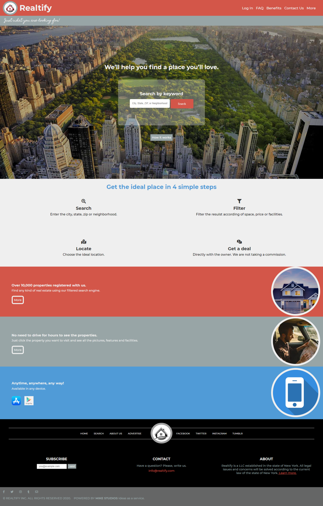

# HTML Capstone

The purpose of thes project is demonstrate proficiency using HTML5 and CSS3. The project consist of creating a responsive page of [this project right here](https://www.behance.net/gallery/25563385/PatashuleKE).

## Built With

- HTML5
- CSS3

## Live Demo

- [Live Demo Link](https://raw.githack.com/nrqrmz/realtor/testing-branch/search-results.html)

## Author

👤 **Enrique Ramirez**

- Github: [@nrqrmz]( https://github.com/nrqrmz)
- Twitter: [@Enrique93407289 ](https://twitter.com/Enrique93407289)
- Linkedin: [linkedin](https://www.linkedin.com/in/enrique-ramirez-6157b11aa/)

## 🤝 Contributing

Contributions, issues and feature requests are welcome!

## Show your support

Give a ⭐️ if you like this project!

## Acknowledgments

- Mireya Luna
- Mateo Mojica
- Team-132-The-Cookie-Monsters
- Mathew Njuguna
- Sam Anchola
- Behance
- GitHub
- Microverse
- TheOdinProject

#### This project was originally designed by:
- [Mathew Njuguna](https://www.behance.net/mathewnjuguna)
- [Sam Anchola](https://www.behance.net/aweSam)

## 📝 License

This project is open licensed.
